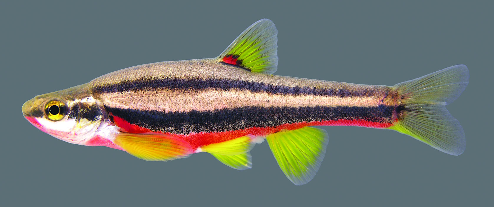

```{r setup, include=FALSE}
library(tidyverse) #importing, tidying, plotting data
library(knitr) #making tables
library(leaflet)
library(tinytex) #may need for knitting pdf versions of .rmd file
library(dslabs)
library(dplyr)
library(tidyr)
library(ggplot2)
library(data.table)
library(ggfortify)
library(emmeans)
library(readr)
library(multcomp)
library(pwr)


#knitr::opts_chunk$set(fig.width = 5, fig.asp = 1/3) #force figures to be a certain size and aspect ratio
#opts_chunk$set(echo=FALSE)   #can force hide all code in the output; disables 'code folding'
```

```{r import data}
library(readr)
data_SRBD_color <- read_csv("data/SRBDSex_RedColoration.csv")
```


This is an example of an [R Markdown](http://rmarkdown.rstudio.com) Notebook. When you execute code within the notebook, the results appear beneath the code. This allows you to have a linear workflow, which will help you collaborate with others more efficiently. The basics of R Markdown can be found [here](https://r4ds.had.co.nz/r-markdown.html). There is also a cheatsheet in the RStudio help menu.

<span style="color:blue">First, lets make a simple graph using some base R code.</span>


```{r Scatter Color_SRBD}
ggplot(data_SRBD_color, aes(x = sex, y = Red_Coloration_Percentage, shape = sex, color = sex)) +
	geom_point(size = 5) +
	xlab("Sex") +
	ylab("Red Coloration %") +
theme(
	axis.title.x = element_text(colour = "cornflowerblue", size =rel(2)),
	axis.text.x = element_text(angle = 0, size = 13, vjust = 0.5)) +
  theme(
	axis.title.y = element_text(colour = "purple", size =rel(2)),
	axis.text.y = element_text(angle = 0, size = 13, vjust = 0.5))

ggsave("outputs/scatter.png")
  
```
```{r Box Plot Color_SRBD}
ggplot(data_SRBD_color, aes(x = sex, y = Red_Coloration_Percentage, fill=sex)) +
	geom_boxplot() +
	xlab("Sex") +
	ylab("Red Coloration %") +
	theme_bw()

ggsave("outputs/boxplot.png")
```


```{r autoplot Color_SRBD}	

model_SRBD <- lm(Red_Coloration_Percentage ~ sex,
	data = data_SRBD_color)
autoplot(model_SRBD, smooth.colour = NA)


```

```{r anova Color_SRBD}
summary(model_SRBD)
anova(model_SRBD)  
```


<span style="color:blue">Lets make a simple map for our report.</span>
```{r SRBD Site Map}
leaflet() %>%
  setView(-86.854396, 36.26361 , zoom = 16) %>% #lat-long of the place of interest
  addTiles() %>%
  addProviderTiles('Esri.WorldImagery') %>%
  addMarkers(-86.854396, 36.26361 , popup = "Dry Fork, Whites Creek System")
```

<span style="color:blue">Lets make a simple map for our report.</span>
```{r SRBD Site Map2}
leaflet() %>%
  setView(-87.287965, 36.499277 , zoom = 16) %>% #lat-long of the place of interest
  addTiles() %>%
  addProviderTiles('Esri.WorldImagery') %>%
  addMarkers(-87.287965, 36.499277 , popup = "Rotary Park, Wall Branch Creek System")
```


<span style="color:blue">Lets make a table that displays some of the raw diamond data.</span>

```{r Diamond Table}
#https://rmarkdown.rstudio.com/lesson-7.html
kable(data_SRBD_color[1:21, ], format = "pandoc", caption = 'Table 1. A knitr kable displaying the 21 red coloration percentage values for Southern Redbelly Dace (Chrosomus erythrogaster.')

```

<span style="color:blue">Lets make a table that summarizes the diamond data.</span>

```{r Sex/Color Summary}
summary1 <- summarise(group_by(data_SRBD_color, sex),
          n=n(), 
          mean=mean(Red_Coloration_Percentage), 
          sd=sd(Red_Coloration_Percentage))
kable(summary1, format = "pandoc", caption = 'Table 2. A summary kable displaying number, mean, and standard deviation for both male and female Southern Redbelly Dace (Chrosomus erythrogaster.')
```





